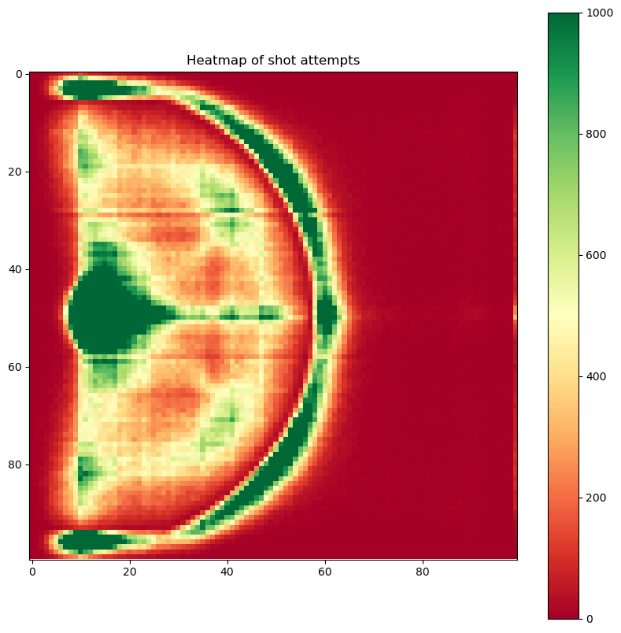
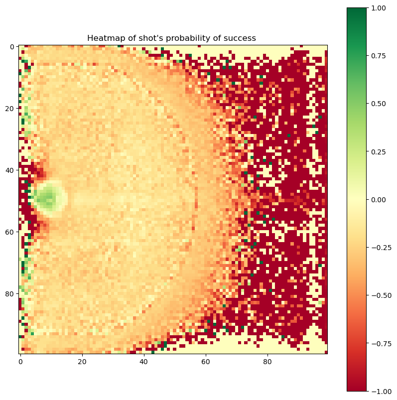
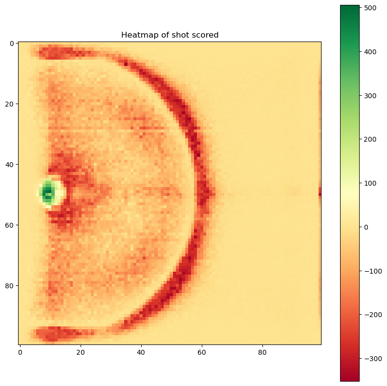

# Milestone 1

## Dataset

For this project, two datasets will be leveraged. 

The primary dataset was sourced from a comprehensive compilation available on GitHub from this [link](https://github.com/DomSamangy/NBA_Shots_04_23). The dataset provides a historical record of 4M NBA shots from 2004 to 2023, detailing player and team information, shot outcomes, and spatial data regarding shot locations.
 
 The secondary dataset was collected from [Kaggle](https://www.kaggle.com/datasets/dansbecker/nba-shot-logs/data) and  enriches the analysis with 128k shots with specific metrics from the 2014/2015 season, such as closest defender and his distance from shooter, shot clock, dribbles and touch-time before the shot.
 
 The datasets are of high quality, requiring minimal preprocessing, mainly to harmonise the 2014/2015 data across both datasets and ensure consistent measurement scales for defender distances and shot locations.

 ## Problematic

 The aim of this project is to offer a more detailed understanding of basketball analytics, one that truly captures the complexity of NBA shots. We're delving into the various factors that impact shot accuracy and examining how these have changed over time for both individual players and the NBA as a whole.

There's a wealth of basketball statistics and visualisations available online, but our project sets out to consider several factors that are often not given enough attention. We'll look at how the distance and identity of the defender can affect shot accuracy, how isolation players compare with those who primarily catch and shoot, and how the game and shot selection have evolved. We will explore how players adapt their shooting after changing teams and analyse who is best suited to take critical shots at crucial moments in a game.

Our visualisations are crafted for basketball enthusiasts eager to gain deeper insights into their favourite players and teams. They will also be valuable for coaches, helping them make informed decisions and devise plays that could lead to higher-percentage shots. Additionally, these insights can assist players in honing their game and shot selection by learning from the improvements and efficiency patterns of successful players.

 ## Exploratory Data Analysis

 The preprocessing steps can be found in the notebook `EDA.ipynb`. The main steps consisted of fixing a few NA values for some players' position and position group, and the inconsistencies of different names for the same player (e.g. OG Anunoby and O.G. Anunoby). We also merged the shots present in both datasets for the season 2014-2015. 

 Below are a few visualizations of the stats about the shots from the primary dataset (2004-2023), mainly a heatmap of the number of shot attempts, a heatmap of the probabilty of a shot's success, and a heatmap of the number of shots which succeeded minus the number of shots which failed.

 
 
 

 ## Related work

 In basketball analysis, looking closely at NBA shot data has given experts a deep look into how players perform, their shooting skills, and how teams plan their games. Among the many ways to show this information, shot charts are a favourite. These charts show where on the court players tend to shoot from and how often they score.
Besides,we discovered a comprehensive analysis for our second dataset which delves into different factors using mostly histograms and scatter plots. This detailed work can be found [here](https://www.kaggle.com/code/mariodelacruzjr/nba-shoot-analysis).

A particularly innovative visualisation that has garnered attention is one developed by Second Spectrum, the Official Optical Tracking Provider of the NBA. This visualisation showcases real-time shot accuracy of players from different zones on the court, offering a dynamic perspective on player efficiency from specific areas of the field.

For our project, we aim to build upon this foundation by incorporating defensive metrics to further enrich the analysis of shot accuracy. Unlike traditional visualisations that focus solely on the accuracy of players from different zones, our approach intends to consider the defender's presence and proximity as significant factors. Recognizing that an open shot by a less effective player, or a mismatch against an inferior defender, can sometimes be more advantageous than a closely contested shot by a top shooter against an elite defender, we plan to integrate these nuances into our analysis. By doing so, we seek to provide a more holistic understanding of shot selection and its outcomes, taking into account not just the shooter's position but also the defensive context.

Another distinctive aspect of our project is the exploration of the temporal evolution of shots, as well as the progression of individual players over time. This approach will allow us to not only capture a snapshot of shooting efficiency and defensive effectiveness but also to observe how these dynamics evolve throughout a season or a player's career. By tracing these changes, we can offer a more nuanced visualisation that reflects the growth of players, shifts in team strategies, and changes in the overall landscape of the NBA.

Our project aspires to stand out by providing a multifaceted analysis that goes beyond conventional shot charts and histograms. By intertwining defensive metrics with shot accuracy and examining the temporal dimension of basketball performance, we aim to unveil deeper insights into the intricate ballet of offence and defence in the NBA. This innovative approach promises to illuminate new strategies, highlight player development, and offer fans and analysts alike a richer understanding of the game.

