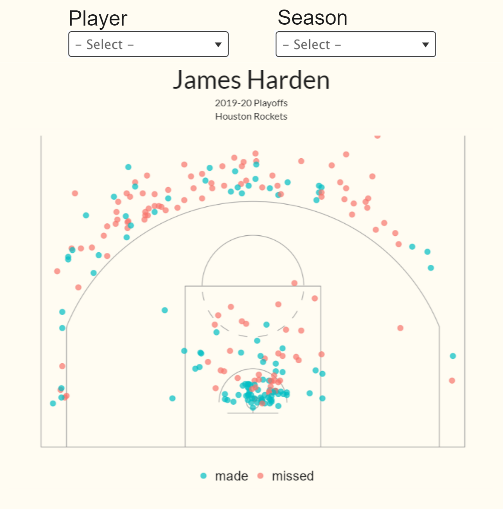
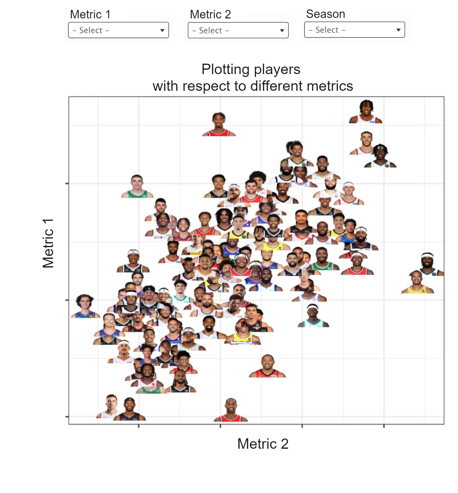
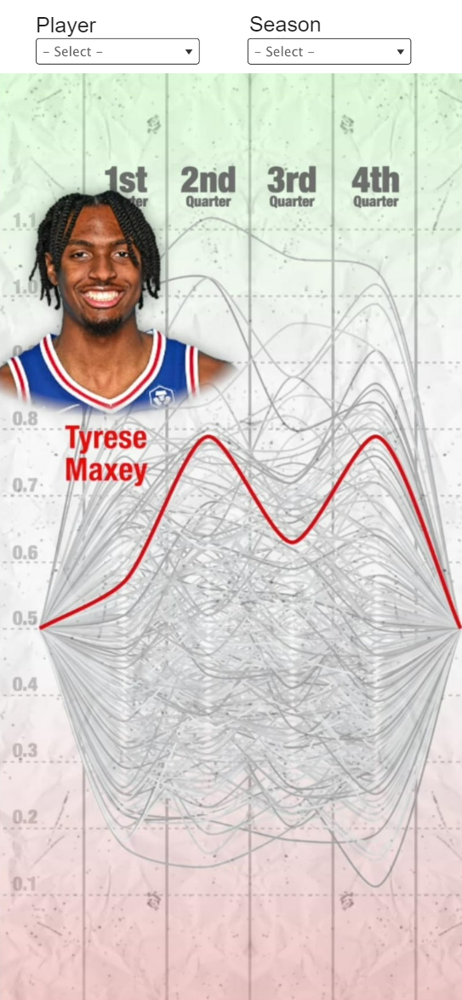

# Milestone 2

## Introduction
Understanding how various factors affect shot outcomes is vital for players, coaches, and analysts alike. For example, the urgency induced by a dwindling shot clock might significantly affect a player's decision-making and accuracy. Such situations often lead to rushed shots or, conversely, highly practiced, clutch shooting under pressure. By analyzing how these conditions influence shot success, stakeholders can refine strategies, enhance player training, and improve game-time decisions.

The skeleton of the website can be found [here](
    https://com-480-data-visualization.github.io/com-480-project-tafrika/)

## Visualization 1: Spatial Visualization Approach
To capture and visualize the effects of these factors, our approach will focus on representing this data spatially on a basketball court. This method will allow users to see not just the statistical data but also the spatial distribution and impact of factors like shot clock time, dribbling, and player positioning. Visualizing this data on a court will provide an intuitive understanding of where players are most effective under specific conditions and how factors like time pressure impact shooting from different court zones.

###### Sketch edited from: https://coolinfographics.com/blog/2016/3/28/ballr-interactive-nba-shot-charts.html

**MVP**:

Interactive Scatter Map on a Basketball Court: This visualization will display shots made and missed, marked as green and red dots, respectively, on a half-court diagram. Users can filter results based on different seasons for example, or the time left on the shot clock, and the number of dribbles taken before the shot. This allows for a dynamic analysis of how different conditions affect shot outcomes.

**EXTRAS**:
- Grouped Shot Analysis: Implement functionality to group shots by filters like shot clock intervals or dribbles to compare efficiency under specific conditions directly on the court visualization. This feature would provide a clearer comparison of how certain factors influence shooting success.
- Dynamic Player Positioning: Allow users to move a player icon around the court and dynamically display the shooting accuracy from those specific areas. This interactive feature would help users explore how player positioning impacts shot success based on historical data.
- Defender Impact Simulation: Introduce the ability to place a defender on the court and adjust their proximity to the shooter. This tool would visualize the effect of defensive pressure on shooting accuracy, offering insights into how well players shoot under close guard.
- League-Wide Behavioral Analysis: Extend the analysis to include the entire NBA league, displaying how shot behavior and influencing factors have changed over time. This would include a comparative tool for analyzing different seasons and player strategies across the league.

## Visualization 2: Comparative Analysis Approach
To provide insights into player performance metrics, we'll implement a comparative visualization that plots NBA players on a scatter plot based on two selected metrics. This comparison will illuminate each player's strengths and areas for improvement relative to their peers, fostering a deeper understanding of individual contributions to the league. By viewing players' positions based on these metrics, users can discern patterns and anomalies that may not be apparent in traditional statistical analyses.

###### Sketch edited from: https://www.celticsblog.com/2022/9/15/23351793/boston-celtics-marcus-smart-derrick-white-malcolm-brogdon-defense-backcourt-point-guard

**MVP**:

Comparative Player Scatter Plot: This core visualization will place players on an interactive scatter plot based on two chosen metrics, such as points per game vs opponent miss percentage when being the closest defender to leverage offensive-defensive prowess of each player.

**EXTRAS**:
- Point Visualization with Detailed Player Cards: Replace player images on the plot with color-coded points for greater visibility. Upon hovering over or clicking a point, a card will display containing the player's image, name, ranking for each of the two metrics, and the actual metric values. This feature will maintain visual clarity while providing in-depth information for each player in an interactive and user-friendly manner.

- Historical Trend Lines: Visual trend lines for individual players across multiple seasons to track performance changes over time.

- Player Grouping: The ability to segment players into clusters by attributes like position or playing style, providing context for their performance on the selected metrics.

## Visualization 3: Quarter-by-Quarter Performance Ranking Graph

The intent of this visualization is to evaluate and display the quarter-by-quarter performance of NBA players, highlighting their scoring prowess or other metrics as the game progresses. This will underscore which players excel in crucial periods, particularly in the 4th quarter, often seen as the decisive phase of the game.

###### Sketch edited from: https://www.tiktok.com/@nbarecappod/video/7346689005028740395?_t=8lqgsvhjdiq&_r=1

**MVP**: 

Quarter-by-Quarter Performance Lines: A dynamic line graph that ranks players based on their performance metrics in each quarter. The visualization will highlight the players who step up their game during the final quarter, thus emphasizing their ability to perform under pressure.

**EXTRAS**:
- Visualization with Detailed Player Cards: Same as the second visualization, we can have cards with players description and their rank within the league when the user hovers over the player’s line. 
- Different metrics: We can use different metrics besides points per minute, such as average dribbles before shots per quarter or use the opponents miss rate when the player is the closest defender to assess the clutch defending of players etc..
- Clutch Performance Indicator: Develop an indicator that highlights players who consistently enhance their performance during pivotal moments, like the 4th quarter or playoff games.

## Tools

- D3.js (Lectures: D3.js, Interactions): Interactive features/animations, Loading multiple datasets
- Chroma.js (Lecture: Perception Colors): Color scales
- Javascript, HTML and CSS (Lectures: Javascript, Basic Web Development): Website implementation, based on the following [template](https://github.com/technext/resume-bootstrap4)
